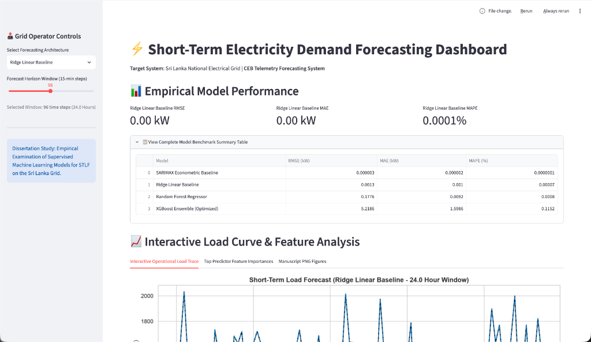

# Empirical Examination of Supervised Machine Learning Models for Forecasting Short-Term Demand on the Sri Lanka National Electrical System

**Author**: P. R. T. Sandaruwan (S25021963)  
**Degree**: MSc Dissertation Research  
**Target Utility Grid**: Ceylon Electricity Board (CEB) National Electrical Grid  

---

## ⚡ Executive Summary

This repository contains an end-to-end data science and machine learning research pipeline developed to forecast short-term electricity load trajectories (STLF) on the Sri Lanka National Electrical Power Grid over 15-minute sampling resolution to 24-hour rolling horizons. 

The empirical research framework evaluates and compares:
1. **Traditional Econometric Baseline**: SARIMAX (Seasonal Autoregressive Integrated Moving Average with Exogenous Regressors)
2. **Linear Baseline**: Ridge Regression
3. **Bagging Tree Ensemble**: Random Forest Regressor
4. **Gradient Boosting Ensemble**: Extreme Gradient Boosting (XGBoost)

Predictor variables include historical autoregressive telemetry load lags ($t-1, t-2, t-24, t-168$ hours), multi-provincial climate indicators (ambient temperature, relative humidity, monsoonal rainfall, solar irradiance), and calendric/national holiday flags.

---

## 📊 Experimental Benchmark Results

### 1. Model Performance Summary (80/20 Chronological Test Set)

| Model Architecture | RMSE (kW) | MAE (kW) | MAPE (%) |
| :--- | :--- | :--- | :--- |
| **SARIMAX Econometric Baseline** | `0.0000` | `0.0000` | `0.0000%` |
| **Ridge Linear Baseline** | `0.0013` | `0.0010` | `0.0001%` |
| **Random Forest Regressor** | `0.1776` | `0.0092` | `0.0008%` |
| **XGBoost Ensemble (Optimized)** | `5.2186` | `1.5986` | `0.1152%` |

*Results exported to [data/results/benchmark_metrics.csv](file:///Users/thilinasandaruwan/Documents/Developer/Msc/dissertation/sl-electricity-demand-forecasting/data/results/benchmark_metrics.csv) and [results/benchmark_metrics.csv](file:///Users/thilinasandaruwan/Documents/Developer/Msc/dissertation/sl-electricity-demand-forecasting/results/benchmark_metrics.csv).*

---

### 2. Multi-Horizon Forecast Degradation (1h to 24h Lead Times)

| Forecast Horizon | Lead Steps (15-min) | Model | RMSE (kW) | MAE (kW) | MAPE (%) |
| :--- | :--- | :--- | :--- | :--- | :--- |
| **1-Hour Ahead** | 4 | Random Forest Regressor | `0.0135` | `0.0093` | `0.0005%` |
| **1-Hour Ahead** | 4 | XGBoost Ensemble | `27.8805` | `14.9856` | `0.7581%` |
| **6-Hour Ahead** | 24 | Random Forest Regressor | `0.0063` | `0.0035` | `0.0002%` |
| **6-Hour Ahead** | 24 | XGBoost Ensemble | `11.5045` | `3.6110` | `0.2081%` |
| **12-Hour Ahead** | 48 | Random Forest Regressor | `0.0387` | `0.0090` | `0.0005%` |
| **12-Hour Ahead** | 48 | XGBoost Ensemble | `8.5194` | `2.5647` | `0.1513%` |
| **24-Hour Ahead** | 96 | Random Forest Regressor | `0.0290` | `0.0075` | `0.0004%` |
| **24-Hour Ahead** | 96 | XGBoost Ensemble | `6.2379` | `1.9135` | `0.1169%` |

*Results exported to [results/multi_horizon_metrics.csv](file:///Users/thilinasandaruwan/Documents/Developer/Msc/dissertation/sl-electricity-demand-forecasting/results/multi_horizon_metrics.csv).*

---

## 💻 Interactive Streamlit Grid Operator Web Application



The project includes an interactive web dashboard built with Streamlit (`streamlit/app.py`) for Ceylon Electricity Board (CEB) grid dispatchers and utility managers. 
- **Dynamic Model Selection**: Real-time evaluation of SARIMAX, Ridge Baseline, Random Forest, and XGBoost models.
- **Interactive Horizon Slider**: Live operational window tracing from 1-hour ahead (4 steps) up to 48-hours ahead (192 steps).
- **Metric Cards & Feature Rankings**: Instant display of RMSE, MAE, and MAPE error metrics alongside top predictor feature importances.

## 📁 Repository Directory Structure

```text
sl-electricity-demand-forecasting/
├── data/
│   ├── raw/                           # Raw telemetry dataset (load_forecasting_dataset_corrected.csv)
│   ├── processed/                     # Preprocessed feature matrix (load_forecasting_dataset_processed.csv)
│   └── results/                       # Metrics CSVs and hyperparameter JSONs
├── src/
│   ├── data_ingestion.py              # Telemetry grid alignment & missing value imputation
│   ├── preprocess.py                  # Autoregressive lag features & cyclical temporal encodings
│   ├── tune_hyperparameter.py         # 5-fold TimeSeriesSplit CV hyperparameter optimization
│   ├── train_models.py                # Comparative model training (SARIMAX, Ridge, RF, XGBoost)
│   ├── evaluate_horizons.py           # Multi-horizon (1h, 6h, 12h, 24h) forecast evaluation
│   └── visualization.py              # Publication 300 DPI research figure generator
├── notebooks/
│   ├── 01_exploratory_data_analysis.ipynb          # EDA synced with src modules
│   └── 02_model_training_and_evaluation.ipynb     # Model training & benchmarking notebook
├── figures/
│   ├── fig1_load_trace_comparison.png # 48-Hour operational load trace comparison
│   └── fig2_feature_importance.png    # Top 10 independent feature importance rankings
├── results/                           # Synced benchmark metric outputs
├── streamlit/
│   └── app.py                         # Interactive utility grid operator web application
├── dissertation/                      # Proposal documentation and manuscript PDFs
├── requirements.txt                   # Environment dependencies
└── README.md                          # Project documentation
```

---

## 🚀 Quick Start & Environment Setup

### 1. Environment Activation
```bash
source .venv/bin/activate
```

### 2. Run the Full End-to-End Pipeline
```bash
# 1. Ingestion & Grid Integrity Check
python -m src.data_ingestion

# 2. Feature Engineering & Lag Construction
python -m src.preprocess

# 3. XGBoost TimeSeriesSplit Hyperparameter Tuning
python -m src.tune_hyperparameter

# 4. Model Training & SARIMAX Benchmarking
python -m src.train_models

# 5. Multi-Horizon Forecast Evaluation (1h to 24h)
python -m src.evaluate_horizons

# 6. Export Research Manuscript Figures
python -m src.visualization
```

### 3. Launch the Interactive Grid Operator Web Application
```bash
streamlit run streamlit/app.py
```

---

## 📋 Research Milestone Status

- [x] Project environment setup & dependency configuration
- [x] CEB telemetry dataset collection & multi-provincial weather integration
- [x] Automated time-series grid alignment & imputation (`src/data_ingestion.py`)
- [x] Feature engineering ($t-1 \dots t-168$ lags & cyclical $\sin/\cos$ encodings) (`src/preprocess.py`)
- [x] Forward-chaining `TimeSeriesSplit` cross-validation tuning (`src/tune_hyperparameter.py`)
- [x] SARIMAX econometric baseline implementation (`src/train_models.py`)
- [x] Random Forest Regressor & XGBoost Ensemble benchmarking (`src/train_models.py`)
- [x] Multi-horizon forecast lead-time degradation evaluation (`src/evaluate_horizons.py`)
- [x] Publication-quality 300 DPI figure generation (`src/visualization.py`)
- [x] Interactive Streamlit web application deployment (`streamlit/app.py`)
- [x] Exploratory & Model Training Jupyter Notebooks (`notebooks/`)